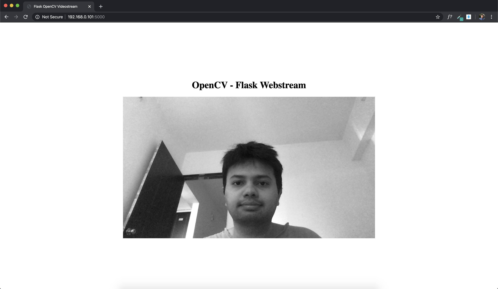

## OpenCV - Flask Webstream
  [](https://www.python.org/downloads/release/python-376/)
  [](https://pypi.org/project/opencv-python/)
  [](https://pypi.org/project/Flask/)
  [](https://opensource.org/licenses/MIT)

This is quick start boiler plate for streaming opencv video capture on web server using flask.

<p align="center">

</p>
<br>

### ⚙️ Installation
Following are the packages required to be installed for running. **Installing these with the help of Anaconda is recommended,** so sub-dependencies of these packages can be taken care automatically. 
```
- flask 1.1.1
- opencv-python 4.2.0.32
- opencv-contrib-python-headless 4.2.0.32
```
<br>

### 🔌 Running main.py
After getting dependencies install just run this file like normal python program, (green play button on top right corner in case you are using IDEs). You might require to run following command before running main.py
```
$ export FLASK_APP=main.py
```
<br>

### 💡 Processing input frames (adding detection algorithms)
To make developement easy, there is myAlgorithm(..) function where you can spice things up with input frame. Example :
```python
# Implement Custom Algorithm here (on frame)
# and return new modified_frame
def myAlgorithm(frame):
    modified_frame = cv2.cvtColor(frame, cv2.COLOR_BGR2GRAY)
    return modified_frame
```
Inside myAlgorithm(..) function you can implement your own detection/image processing algorithms and return modified frame. This modified frame will be shown as the continuos output of frames on web server.

⛳️⛳️⛳️